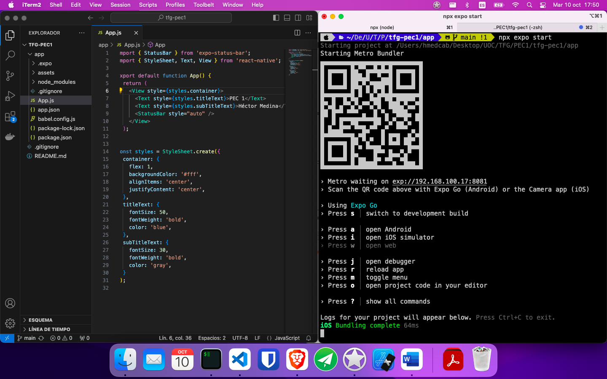

# TFG Multiplataforma - PEC1

El entorno de desarrollo elegido sigue las directrices establecidas en la documentación oficial de React Native , por lo que se empleará Expo Go. Este acercamiento está especialmente recomendado para entornos de bajos recursos, ya que permite un mejor uso de recursos, al desplegar la aplicación en un dispositivo móvil físico, lo que evita utilizar un simulador.

Las dependencias son las siguientes.
-	Node.js : se necesita npm y npx para poder crear un proyecto expo e instalar dependencias.
-	Expo Go  app: se debe descargar la aplicación Expo Go en el dispositivo físico que será utilizado para el desarrollo.
 
Una vez se han instalado las dependencias, debemos crear una cuenta en ExpoGo e iniciar sesión tanto en la aplicación móvil como en la CLI de ExpoGo mediante el siguiente comando.

````
npx expo login
````

Una vez se han realizado los pasos anteriores, se puede clonar un repositorio de GitHub que contiene una aplicación básica. https://github.com/hector-medina/tfg-pec1 

Por razones de seguridad y rendimiento, los paquetes de terceros no están añadidos en el repositorio de GitHub, por lo que deberán instalarse una vez se haya clonado el repositorio, esto se puede hacer con el siguiente comando en la carpeta **app**:

````
npm install
````

Una vez descargado, en la carpeta **app** se deberá ejecutar el siguiente comando:

````
npx expo start
````

Al abrir la aplicación móvil podremos o bien escanear el código QR o acceder a la aplicación directamente en el listado de aplicaciones disponibles.

